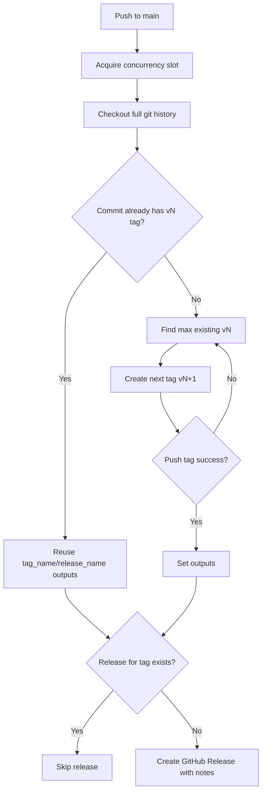

# Release Flow

This repository uses the GitHub Actions workflow in [.github/workflows/release-on-main.yml](.github/workflows/release-on-main.yml) to create an incremental Git tag and GitHub Release on every push to `main`.

## What Triggers a Release

- A push to `main` starts the workflow.
- The workflow needs `contents: write` permission so it can push tags and create releases.

## Runtime Flow

1. GitHub Actions starts the workflow after a push to `main`.
2. The job acquires the `release-on-main` concurrency lock so only one release job runs at a time.
3. The repository is checked out with full history and tags.
4. The workflow fetches the latest tags from origin.
5. If the current commit already has a tag matching `vN`, that tag is reused.
6. Otherwise, the workflow finds the highest existing numeric tag matching `vN`.
7. It computes the next version as the highest tag plus one.
8. It creates the new tag on the current commit and pushes it to origin.
9. If another run wins the race first, the workflow refreshes tags and retries.
10. Once a tag is selected, the workflow checks whether a GitHub Release already exists for that tag.
11. If the release already exists, the workflow exits successfully.
12. If the release does not exist, the workflow creates it and asks GitHub to generate release notes automatically.

## Example Version Progression

- If the repo already has `v0`, the next successful push to `main` creates `v1`.
- The following pushes create `v2`, `v3`, and so on.

## Safety Properties

- Rerun-safe: a rerun on the same commit reuses the existing `vN` tag if present.
- Concurrency-safe: only one release job is active at a time.
- Retry-aware: tag creation retries if a concurrent run creates the same next version first.
- Idempotent release creation: if the GitHub Release already exists for a tag, it is skipped.

## Diagram

## Related Files

- Workflow: [.github/workflows/release-on-main.yml](.github/workflows/release-on-main.yml)
- Backend container image: [backend/Dockerfile](backend/Dockerfile)