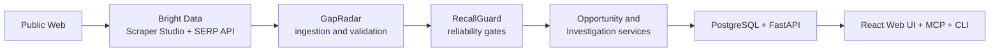

# GapRadar

Discover gaps. Prove the data behind them.

GapRadar is a radar for market gaps — not just another web scraper. It continuously turns real-world pain signals into ranked opportunities by detecting unmet demand, connecting those signals with emerging research, and examining the competitive landscape. Every opportunity is backed by traceable evidence and protected by a trust layer that detects extraction drift before bad data can influence decisions. GapRadar can also investigate any user-supplied idea independently, combining academic research, demand evidence, and competitor intelligence. 

## Table of Contents

- [Team](#team)
- [Live Links](#live-links)
- [Screenshots](#screenshots)
- [Screenshots](#screenshots-1)
- [What Problem It Solves](#what-problem-it-solves)
- [Core Product Modes](#core-product-modes)
- [High-Level Architecture](#high-level-architecture)
- [Tech Stack](#tech-stack)
- [Scrape Resources](#scrape-resources)
- [Bright Data product Integration](#bright-data-product-integration)
- [Deployment](#deployment)
- [Repository Structure](#repository-structure)
- [Use Guide](#use-guide)
- [Quick Start (Local Setup)](#quick-start-local-setup)
- [Run the App Locally](#run-the-app-locally)
- [Bright Data Usage](#bright-data-usage)
- [Structured Output Samples](#structured-output-samples)
- [Public Data and Compliance Confirmation](#public-data-and-compliance-confirmation)
- [Reliability Principle](#reliability-principle)
- [MCP and CLI](#mcp-and-cli)
- [Demo Video Checklist](#demo-video-checklist)
- [AI Usage Disclosure](#ai-usage-disclosure)
- [FAQ](#faq)

## Team

- Team Name: Proof of Chaos (POC)
- Members: Yash Mishra, Udit Rawal, Mohit Kushwaha

## Live Links

- Live App: https://gap-radar-blush.vercel.app/
- Repository: https://github.com/mohitkushwaha0601/GapRadar
- Commit History: https://github.com/mohitkushwaha0601/GapRadar/commits/main/
- Pull Requests: https://github.com/mohitkushwaha0601/GapRadar/pulls?q=
- Releases: https://github.com/mohitkushwaha0601/GapRadar/releases
- License: https://github.com/mohitkushwaha0601/GapRadar?tab=MIT-1-ov-file
- Demo Video: ADD_YOUR_YOUTUBE_LINK_HERE

## Screenshots
< Upload IMages>
## Screenshots

Add your final screenshots here before submission:
- Dashboard view
- Opportunity detail view
- Reliability view
- Investigation workflow viewa

Suggested screenshot captions:
- Discovery dashboard with ranked opportunities
- Opportunity detail with evidence and score context
- RecallGuard reliability view (incident/trust state)
- Investigation workflow (research + demand + competitors)

## What Problem It Solves

Most founders and product teams validate ideas by stitching together search engines, forums, research papers, competitor sites, spreadsheets, and AI tools. That process is slow, fragmented, and often weak on traceable evidence.

GapRadar unifies that into one system that:

- discovers market pain signals from public sources,
- converts them into ranked opportunities,
- investigates user-supplied hypotheses across multiple evidence streams,
- and enforces reliability checks so broken extraction does not silently become bad intelligence.

## Core Product Modes

1. Discovery Mode
- Ingests trusted public-web problem signals.
- Ranks opportunities using structured signals.

2. Investigation Mode
- Lets users submit a hypothesis.
- Collects and presents research evidence, demand evidence, and competitor candidates.

Detailed product docs:

- [docs/product/overview.md](docs/product/overview.md)
- [docs/product/demo-runbook.md](docs/product/demo-runbook.md)

Related API surfaces:

- [backend/app/api/v1/routes/opportunities.py](backend/app/api/v1/routes/opportunities.py)
- [backend/app/api/v1/routes/investigations.py](backend/app/api/v1/routes/investigations.py)
- [backend/app/api/v1/routes/reliability.py](backend/app/api/v1/routes/reliability.py)

## High-Level Architecture

## Tech Stack

- Backend: Python, FastAPI, SQLAlchemy, Alembic
- Frontend: React, TypeScript, Vite
- Database: PostgreSQL
- Web Intelligence: Bright Data Scraper Studio and SERP API
- Agent Interface: MCP server + CLI client

## Scrape Resources
- Fix my Itch - Razorpay [https://razorpay.com/m/fix-my-itch/]
- Arxiv - open-access archive [https://arxiv.org/]

## Bright Data product Integration
- Bright Data Scraper Studio
- Bright Data Collector CLI
- Bright Data SERP API

### Deployment

- Backend + PostgreSQL: Railway
- Frontend: Vercel

Deployment reference:

- [docs/architecture/deployment_architecture.md](docs/architecture/deployment_architecture.md)

## Repository Structure

- [backend](backend): API, domain logic, integrations, migrations, tests
- [frontend](frontend): web app UI
- [docs](docs): architecture, integrations, product docs
- [external](external): Bright Data and harness artifacts
- [demo](demo): demo fixtures and proof assets
- [scripts](scripts): setup and utility scripts

## Use Guide

1. Open the dashboard and review top opportunities in Discovery Mode.
	- Use this to identify the strongest current market-gap candidates.
2. Open an opportunity detail to inspect scoring and evidence context.
	- Review signal strength and supporting context before making conclusions.
3. Visit reliability pages to inspect trust and incident signals.
	- Confirm current pipeline trust posture before using output in decisions.
4. Create an Investigation with your own hypothesis.
	- Example: "AI compliance assistant for small exporters".
5. Run investigation analysis and review:
	- research evidence,
	- demand evidence,
	- competitor candidates.

For demo sequencing and narration:

- [docs/product/demo-runbook.md](docs/product/demo-runbook.md)

## Quick Start (Local Setup)

Run one command from repo root:

make setup

What it does:

- creates backend/.env from backend/.env.example if missing,
- fills local defaults for database and CORS,
- creates frontend/.env.local with local API URL,
- generates GAPRADAR_MCP_API_KEY for local MCP testing,
- starts a local PostgreSQL Docker container when Docker is available,
- installs backend and frontend dependencies,
- runs Alembic migrations.

Requirements before running setup:

- [uv](https://docs.astral.sh/uv/)
- [Node.js + npm](https://nodejs.org/)
- [Docker](https://www.docker.com/) (optional but recommended for local PostgreSQL)

Bootstrap script:

- [scripts/setup_local.sh](scripts/setup_local.sh)

## Run the App Locally

Terminal 1:

make backend

Terminal 2:

make frontend

Local endpoints:

- Frontend: http://localhost:5173
- Backend API: http://localhost:8000
- API health check: http://localhost:8000/api/v1/health
- MCP endpoint: http://localhost:8000/mcp

Useful commands:

- make test
- make lint
- cd backend && uv run alembic upgrade head

## Bright Data Usage

GapRadar uses Bright Data in three paths:

1. Custom Scraper Studio collector for Razorpay Fix My Itch (discovery).
2. Custom Scraper Studio collector for arXiv search pages (research evidence).
3. Bright Data SERP API integration for demand and competitor evidence.

See detailed docs:

- [docs/integrations/brightdata-usage.md](docs/integrations/brightdata-usage.md)
- [docs/integrations/brightdata-custom-scraper-integration.md](docs/integrations/brightdata-custom-scraper-integration.md)

## Structured Output Samples

Representative structured outputs for discovery, arXiv, and SERP normalization are documented in:

- [docs/integrations/structured-output-samples.md](docs/integrations/structured-output-samples.md)

## Public Data and Compliance Confirmation

GapRadar is designed to use publicly accessible data sources.

It does not intentionally scrape private, login-gated, account-restricted, or paywalled content, and does not attempt to bypass access controls.

Details:

- [docs/integrations/public-data-compliance.md](docs/integrations/public-data-compliance.md)

## Reliability Principle

AI proposes. RecallGuard proves.

APPROVED != RECOVERED

A scraper repair is considered recovered only after a fresh independent execution passes mandatory validation gates.

## MCP and CLI

GapRadar also exposes the same intelligence surface through MCP and a CLI client for automation and agent use.

Backend MCP modules are under [backend/app/mcp_server](backend/app/mcp_server).

MCP and CLI references:

- [backend/app/cli/main.py](backend/app/cli/main.py)
- [backend/app/mcp_server/server.py](backend/app/mcp_server/server.py)

## Demo Video Checklist

The demo should cover:

- project overview,
- architecture and stack,
- end-to-end flow,
- key learning points (optional).

Add link:

- Demo Video: ADD_YOUR_YOUTUBE_LINK_HERE

## AI Usage Disclosure

AI-assisted development tools were used for implementation assistance, debugging, testing, architecture review, documentation, and research.

All submitted implementation is reviewed and understood by the team. AI agents are advisory and do not have authority over recovery decisions.

Full disclosure note:

- [AI_USAGE.md](AI_USAGE.md)

## FAQ

1. Is GapRadar just a scraper?
No. It is an opportunity intelligence and investigation platform with reliability gating.

2. What makes it trust-aware?
RecallGuard evaluates extraction reliability and blocks untrusted signals from decision surfaces.

3. Can users investigate their own ideas?
Yes. Investigation Mode is designed for user-supplied hypotheses.

4. Does GapRadar use private or login-protected data?
The platform is designed for public-web sources and does not intentionally bypass access controls.

5. Where are deployment notes?
See [docs/architecture/deployment_architecture.md](docs/architecture/deployment_architecture.md).
