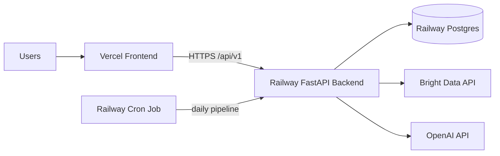

# Deployment Strategy: Vercel + Railway

This runbook defines how to deploy GapRadar with:

- Frontend on Vercel
- Backend API on Railway
- PostgreSQL on Railway
- Scheduled daily pipeline execution on Railway

It is written to match the current codebase layout and behavior.

## 1. Architecture



## 2. Repository Components in Scope

- Frontend app: `frontend/`
- Backend app: `backend/app/`
- Backend container: `backend/Dockerfile`
- DB migrations: `backend/alembic/`
- Scheduler entrypoint: `backend/app/jobs/daily_pipeline.py`
- API health endpoint: `/api/v1/health`

Notes:

- `external/` contains integration artifacts and references, not deployable runtime services.
- Background pipeline execution in the API process is intentionally in-process and non-durable.

## 3. Environment Strategy

Use separate environments:

- `staging`
- `production`

Each environment should have its own:

- Vercel project
- Railway project
- Railway Postgres instance
- Secret set

## 4. Railway Setup (Backend + Postgres)

## 4.1 Create Services

1. Create a Railway project.
2. Add Postgres to the project.
3. Add backend service from this repository:
   - Root directory: `backend`
   - Build method: Dockerfile (`backend/Dockerfile`)

## 4.2 Backend Runtime Config

Set these backend variables in Railway:

- `APP_ENV=production`
- `DATABASE_URL=<railway postgres url using psycopg driver>`
- `CORS_ORIGINS=<comma-separated frontend origins>`
- `BRIGHTDATA_API_KEY=<secret>`
- `BRIGHTDATA_BASE_URL=https://api.brightdata.com`
- `OPENAI_API_KEY=<secret, optional if semantic matching enabled>`
- `OPENAI_MODEL=gpt-5-mini`
- `OPENAI_REASONING_EFFORT=medium`
- `HARNESS_API_KEY=<optional, currently placeholder integration>`

Backend listens on port `8000` using uvicorn from Docker CMD.

## 4.3 Health Check

Configure service health check path:

- `/api/v1/health`

Expected response body:

```json
{"status":"ok","service":"gapradar-api"}
```

## 5. Database Migrations (Railway)

Run migrations as a release step, not inside app startup.

Command:

```bash
cd backend
uv run alembic upgrade head
```

Recommended release order:

1. Deploy candidate build.
2. Run `alembic upgrade head` as one-off command in target environment.
3. Continue rollout only if migration succeeds.
4. Verify app health endpoint.

Rollback guidance:

- Prefer application rollback first.
- Use schema downgrade only when strictly required and validated.

## 6. Railway Scheduler (Daily Pipeline)

GapRadar explicitly expects scheduling to be handled by deployment.

Create a Railway cron job with command:

```bash
cd backend
uv run python -m app.jobs.daily_pipeline
```

Suggested initial frequency:

- Once per day (off-peak time)

Behavior notes:

- Job exits `0` when all collectors were processed (including degraded detections).
- Job exits `1` if one or more collectors fail unexpectedly.
- Job also resumes unfinished pipeline runs first.

## 7. Vercel Setup (Frontend)

## 7.1 Project Config

Create Vercel project with:

- Root directory: `frontend`
- Install command: `npm install`
- Build command: `npm run build`
- Output directory: `dist`

Set environment variable:

- `VITE_API_BASE_URL=https://<railway-backend-domain>`

## 7.2 SPA Routing

Frontend uses BrowserRouter. Configure rewrite fallback to `index.html`.

Create `frontend/vercel.json`:

```json
{
  "rewrites": [{ "source": "/(.*)", "destination": "/index.html" }]
}
```

## 8. CORS Policy

Backend CORS is sourced from `CORS_ORIGINS` as comma-separated values.

Production example:

```env
CORS_ORIGINS=https://gapradar.vercel.app
```

Staging example:

```env
CORS_ORIGINS=https://gapradar-staging.vercel.app
```

If multiple allowed origins are required:

```env
CORS_ORIGINS=https://gapradar.vercel.app,https://gapradar-staging.vercel.app
```

## 9. CI/CD Strategy

Keep backend quality gates before deploy:

- Lint
- Tests
- Docker image build

Then deploy:

1. Deploy backend to Railway.
2. Run migrations.
3. Verify backend health.
4. Deploy frontend to Vercel with matching `VITE_API_BASE_URL`.

Optional:

- Deploy staging on PRs.
- Deploy production on merge to `main`.

## 10. Production Readiness Checklist

- [ ] Railway Postgres provisioned.
- [ ] Backend deployed from `backend/` Dockerfile.
- [ ] All backend env vars set.
- [ ] `alembic upgrade head` succeeds in target environment.
- [ ] Backend health check passes at `/api/v1/health`.
- [ ] Vercel frontend deployed from `frontend/`.
- [ ] `VITE_API_BASE_URL` points to Railway backend URL.
- [ ] SPA rewrite configured on Vercel.
- [ ] `CORS_ORIGINS` includes active Vercel domain(s).
- [ ] Railway cron job configured for `app.jobs.daily_pipeline`.
- [ ] Smoke test validates frontend -> backend API calls.

## 11. Smoke Test Plan

After deployment:

1. Open frontend URL.
2. Confirm opportunities page loads without network/CORS errors.
3. Call backend health endpoint directly.
4. Trigger one pipeline run from API and verify run status polling.
5. Confirm cron logs show successful scheduled run.

## 12. Known Constraints (Current Design)

- API background tasks are in-process, not a durable queue.
- Durability for interrupted work relies on persisted pipeline state plus scheduled resume.
- `external/harness/mcp-spec` is repository reference material, not an active backend MCP server deployment.

## 13. Next Evolution Path

When traffic increases, evolve in this order:

1. Move pipeline execution from in-process background tasks to a dedicated worker service.
2. Introduce durable queue/broker semantics.
3. Add explicit staging/prod migration jobs in CI.
4. Add observability dashboards and alerts for:
   - pipeline failures
   - cron failures
   - provider error spikes
