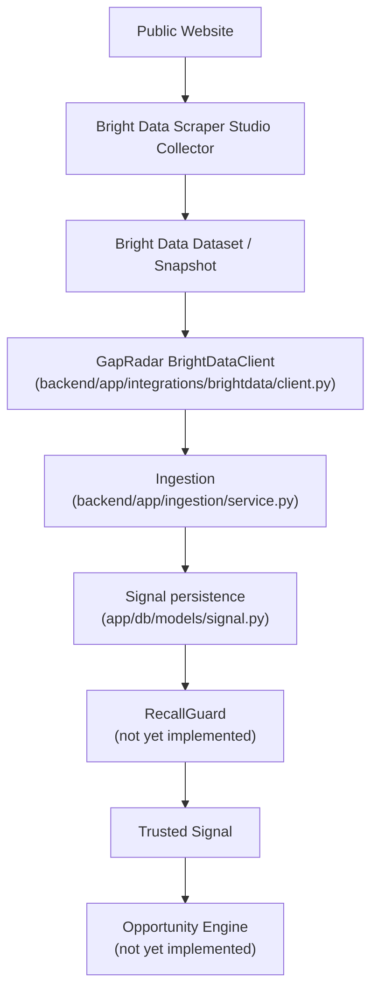
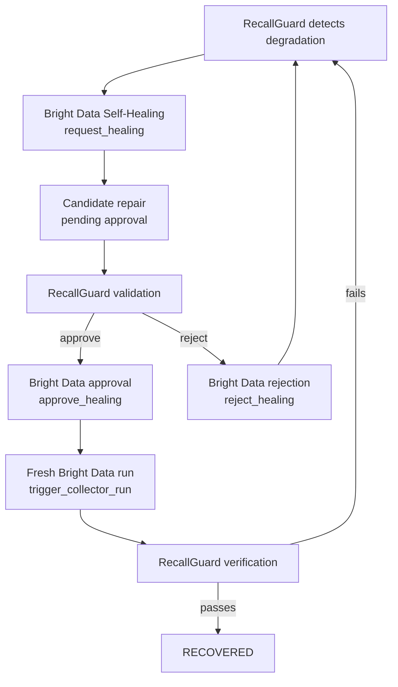
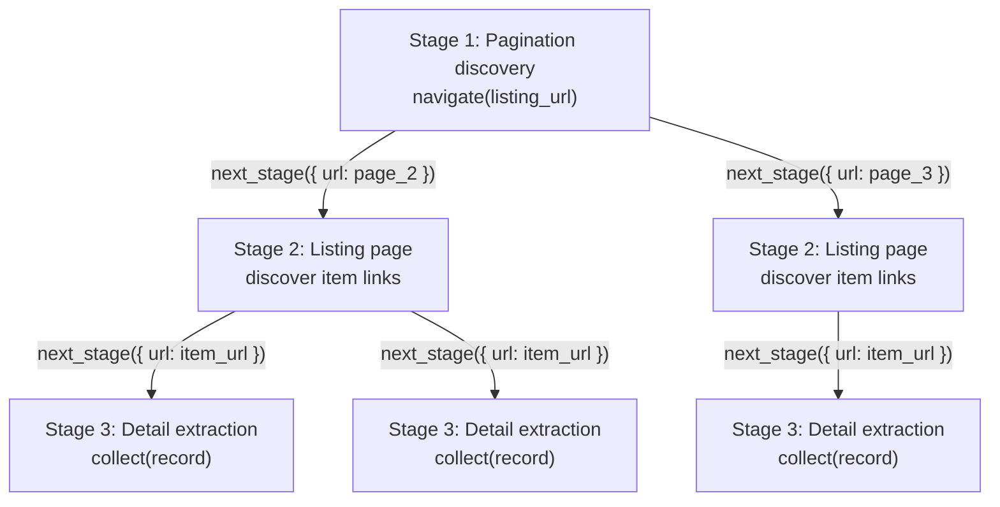
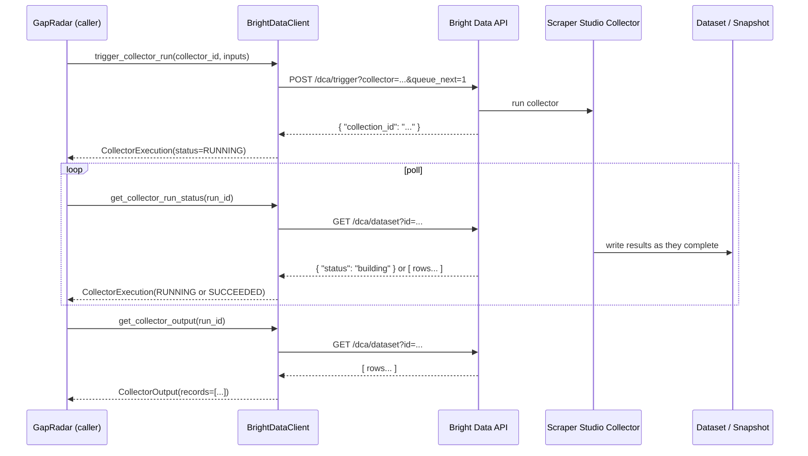
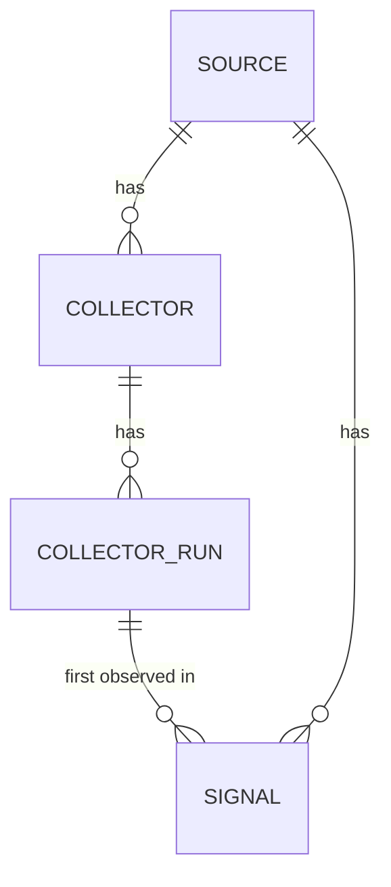
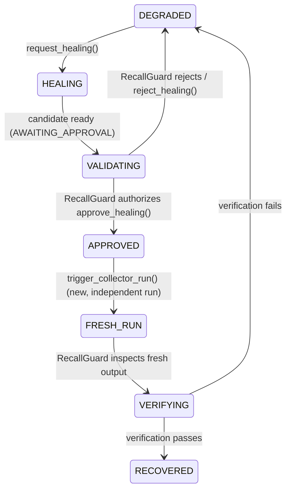

# Bright Data Custom Scraper Integration

Engineering reference for how a Bright Data custom Scraper Studio collector
integrates with the GapRadar backend. This document reflects the actual
repository implementation as of Phase 5 (ingestion). Where a detail is
about Bright Data's platform rather than GapRadar's own code, it is backed
by an official Bright Data source (docs.brightdata.com or
github.com/brightdata/cli) and cited. Anything not confirmed against one
of those sources is explicitly labeled:

> **UNVERIFIED / IMPLEMENTATION-DEPENDENT**

Repository code referenced throughout:

- `backend/app/config.py`
- `backend/app/integrations/brightdata/{client.py,schemas.py,errors.py}`
- `backend/app/ingestion/{schemas.py,normalizer.py,identity.py,service.py}`
- `backend/app/db/models/{source.py,collector.py,collector_run.py,signal.py}`
- `external/brightdata/{collectors,schemas,examples}/`

---

## 1. What Is a Bright Data Custom Scraper?

A **Scraper Studio collector** is a scraper you author, test, and publish
inside Bright Data's hosted Scraper Studio IDE. It runs entirely on
Bright Data's infrastructure — proxying, browser automation, retries,
CAPTCHA handling, and the actual page interaction all happen there, not
in GapRadar's process. Once published, a collector has a stable
**collector ID** (Bright Data's docs and CLI show the format `c_...`) and
can be triggered repeatedly via API.

A collector is built from two cooperating pieces of code, plus a schema:

- **Interaction code** — navigates pages, clicks, scrolls, waits, and
  decides when to call the parser or advance to another stage.
- **Parser code** — turns the loaded page/response into structured
  records via `collect()`.
- **Output schema** — the shape of the records the collector produces,
  generally inferred from what gets passed to `collect()`.

*(Source: [docs.brightdata.com/datasets/scraper-studio/basics-of-web-scraping](https://docs.brightdata.com/datasets/scraper-studio/basics-of-web-scraping) — "The architecture comprises six components: inputs, interaction code, parser code, stages, workers, and output records.")*

### Why a custom scraper instead of generic URL scraping

GapRadar's signals come from specific structured surfaces (forum threads,
review pages, complaint boards) where the meaningful content is buried in
site-specific markup — a title, a body, an author, a timestamp, maybe an
upvote count. A generic "fetch this URL and return raw HTML/markdown"
tool would push that extraction problem into GapRadar's own backend,
which this project deliberately avoids (see Phase 5: no LLM-based
extraction, no dynamic scraping logic in the FastAPI process). A
purpose-built Scraper Studio collector does that structural extraction
once, on Bright Data's side, and hands GapRadar already-structured
records.

### Where execution actually happens

> **The scraper is never executed inside the FastAPI process.**

`backend/app/integrations/brightdata/client.py` (`BrightDataClient`) is a
pure HTTP adapter. It sends a trigger request, polls for completion, and
parses the resulting JSON. GapRadar's PostgreSQL database stores only:

- collector identity (`app/db/models/collector.py` — `provider`,
  `external_collector_id`)
- run identity (`app/db/models/collector_run.py` — `external_run_id`,
  `status`, timestamps, `record_count`, `raw_metadata`)
- provider metadata (untrusted, stored as-is — see §7 and §19)
- normalized GapRadar records (`Signal` rows, produced by
  `app/ingestion/`)

The scraper's actual code (interaction + parser logic) lives and runs on
Bright Data's platform, authored/edited through Scraper Studio's IDE (or
the Bright Data CLI's AI-assisted `scraper create`/`scraper heal` — see
§17). GapRadar's repository keeps only *reference* artifacts for these
collectors under `external/brightdata/` (see §15) — not the executable
scraper itself.

---

## 2. Architecture Diagrams

### 2.1 Primary data-collection path



> **Note:** RecallGuard and the Opportunity Engine are architectural
> destinations described in the project README and are represented as
> empty package stubs in this repository (`app/recallguard/`,
> `app/opportunity_engine/`) at the time of writing. Ingestion (§11)
> stops at Signal persistence and does not call either.

### 2.2 Self-healing side-flow



**Bright Data approval and RecallGuard recovery are two different
events, performed by two different systems, and must never be conflated:**

| | Who decides | What it means |
|---|---|---|
| **Bright Data approval** | A human (or `--auto-approve`, never used by GapRadar) reviewing a candidate diff | Bright Data will commit the proposed template change on its own side |
| **RecallGuard recovery** | RecallGuard's own validation, against a *fresh, independent* collector run | GapRadar trusts the collector's output again |

`APPROVED != RECOVERED`. See §13 for the full boundary explanation.

---

## 3. Custom Scraper Development Workflow

Recommended workflow for building a new GapRadar-facing collector.

**STEP 1 — Choose a public, policy-compliant source.**
Only public web pages. Never login-protected, private, or paywalled
content (see §20).

**STEP 2 — Inspect the website structure.**
Identify the listing page(s), the detail page(s), and where the fields
GapRadar needs (title, body, timestamp, a stable per-item identifier if
one exists) actually live in the DOM or in an underlying JSON response.

**STEP 3 — Decide Code Worker vs Browser Worker.**

> *Verified: [docs.brightdata.com/datasets/scraper-studio/basics-of-web-scraping](https://docs.brightdata.com/datasets/scraper-studio/basics-of-web-scraping)*

- **Code Worker** — handles raw HTTP requests/responses. Use it when "the
  data is available in the raw HTML" or from "a public JSON endpoint." It
  cannot click, scroll, type, or run browser-only functions.
- **Browser Worker** — runs a real headless browser. Use it when "the
  page renders data with JavaScript" or you "need to click, scroll, type,
  or interact with the page."

Bright Data's own guidance: *"Start with a Code worker when possible.
Switch to a Browser worker when the target data is not available."*

**STEP 4 — Define the scraper input.**
The input schema defines what values the scraper receives per run
(commonly `url`, sometimes `keyword`/`location`/custom fields), accessed
in interaction code via the `input` object.

```json
{
  "url": "https://example.com/forum/thread/123"
}
```

**STEP 5 — Build interaction code.**

> *Function names verified against [docs.brightdata.com/datasets/scraper-studio/functions](https://docs.brightdata.com/datasets/scraper-studio/functions)*

| Function | Purpose |
|---|---|
| `navigate(url)` | Load a URL in the browser |
| `wait(...)` | Wait for an element to appear |
| `wait_network_idle()` | Wait until outstanding network requests settle |
| `click(...)` | Click an element *(Browser Worker only)* |
| `scroll_to(...)` / `scroll_to_all(...)` | Scroll an element (or every matching element) into view *(Browser Worker only)* |
| `parse()` | Run the parser code against the current page/response |
| `collect(data)` | Append one structured record to the output dataset |
| `next_stage(input)` | Queue input for the next stage (fan-out to child crawls) |
| `rerun_stage(input)` | Re-run the current stage with new input |

> The task brief's suggested name `scroll()` is not the literal Bright
> Data function name — the documented functions are `scroll_to()` and
> `scroll_to_all()`. Documented here as confirmed, not as originally
> phrased.

The full function reference is considerably larger (waiting/interaction
helpers, network/response tagging, session/proxy routing, browser
configuration, failure marking such as `bad_input()`/`blocked()`, and
value constructors like `Image()`/`Money()`) — see the docs page linked
above for the complete list. Only the functions relevant to a typical
GapRadar collector are tabulated here to keep this reference usable.

**STEP 6 — Build parser code.**

> *Verified: [docs.brightdata.com/datasets/scraper-studio/functions](https://docs.brightdata.com/datasets/scraper-studio/functions)*

Parser code receives the loaded page and extracts structured fields using
a Cheerio-style `$` (Bright Data's docs describe Cheerio as implementing
"a subset of jQuery features"):

```js
// conceptual — see external/brightdata/collectors/<name>/ for real code
function parse($) {
  const title = $('h1.thread-title').text_sane();
  const author_href = $('a.author-link').attr('href');
  collect({ title, author_href });
}
```

- `$(selector).text_sane()` — a **Bright Data-specific** helper (confirmed
  in the functions reference) that returns text with whitespace
  normalized, e.g. `"foo bar baz"` instead of raw `text()` output full of
  newlines/tabs.
- `$(selector).filter_includes(text)` — Bright Data-specific, filters
  elements by text content.
- `.attr('name')` — standard Cheerio/jQuery-subset attribute access. This
  is baseline Cheerio behavior (per Bright Data's own description of the
  library), not a Bright Data-specific addition, so it is not itemized on
  the functions reference page the way `text_sane()`/`filter_includes()`
  are.
- Scoping to a subtree: standard Cheerio pattern, `$(element).find(selector)`.

**STEP 7 — Define the structured output schema.**
Per Bright Data's docs, the output schema "is usually generated from the
records passed to `collect()`" — fields collected populate the schema
automatically rather than being declared separately up front.

**STEP 8 — Test using preview/debug.**
Use Scraper Studio's in-IDE preview/debug tooling to run the collector
against real inputs before publishing.
> **UNVERIFIED / IMPLEMENTATION-DEPENDENT** — the exact preview/debug UI
> mechanics were not independently confirmed against a specific docs page
> for this reference; treat the IDE's own in-product guidance as
> authoritative.

**STEP 9 — Publish/deploy the collector.**
Publishing makes the collector triggerable via the API described in §9.

**STEP 10 — Record the collector ID for GapRadar.**
Store the published collector's ID as `Collector.external_collector_id`
(with `provider="brightdata"`) — see §10.

---

## 4. Multi-Stage Scraper Example (Conceptual)

A neutral, three-stage fan-out example — not tied to any specific real
site — illustrating `next_stage()`:

**Stage 1 — Pagination discovery.** Given a starting listing URL,
determine how many pages of results exist and call `next_stage()` once
per page URL.

**Stage 2 — Listing page URL discovery.** For each page, extract the
links to individual item detail pages and call `next_stage()` once per
item URL.

**Stage 3 — Detail extraction.** For each item URL, extract the fields
GapRadar needs and `collect()` a record.



Each `next_stage({ url })` call fans one parent crawl out into many child
crawls — per Bright Data's docs, this "creates parent-child relationships
between crawls," the canonical use case being "Search results → detail
pages" or "Category pages → product pages."

---

## 5. GapRadar Output Contract

This is GapRadar's own conceptual contract for what a collector's
records should look like by the time they reach ingestion — **not** a
Bright Data platform concept. It is defined and enforced by
`app/ingestion/normalizer.py` (`normalize_record`), which is the actual
source of truth used here.

`app/ingestion/schemas.py` documents it directly:

> *"This normalizer assumes the record already uses GapRadar's own
> conceptual key names (external_id, canonical_url, title, body,
> signal_type, observed_at, metadata) — how a specific real collector's
> native output gets mapped onto these names is a collector-configuration
> concern, out of scope here."*

| Field | Required | Meaning |
|---|---|---|
| `external_id` | optional | Stable source identity when the provider supplies one (e.g. a forum post ID). If absent or blank, GapRadar derives a deterministic fallback identity itself — see §10/Phase 5's identity formula (`app/ingestion/identity.py`). |
| `canonical_url` | **required** | The canonical URL for evidence/provenance. Must parse as `http`/`https`; normalized (lowercased scheme/host, fragment stripped, single trailing slash collapsed, query string preserved verbatim). |
| `title` | **required** | Original semantic content — trimmed and whitespace-collapsed only; never paraphrased or summarized. |
| `body` | **required** | Original semantic content, same normalization rule as `title`. |
| `signal_type` | **required** | GapRadar's own classification input — must be one of the `SignalType` enum values (`complaint`, `question`, `feature_request`, `review`, `other`; `app/domain/enums.py`). **How this gets assigned upstream (per-collector static config, a future rule engine, etc.) is not yet defined anywhere in this repository** — flagged as an open question in the Phase 5 report, not invented here. |
| `observed_at` | **required** | The source's own observation time — must be timezone-aware (naive timestamps are rejected outright, never assumed to be UTC) and is converted to UTC. |
| `metadata` | optional | Provider/source metadata, preserved verbatim as a JSON object. **Always treated as untrusted** — see §19. |

> This table matches `app/ingestion/normalizer.py` as implemented in
> Phase 5. If that file changes, this table is stale — normalizer.py is
> the source of truth, not this document.

Rejection reasons a malformed record can hit (`RejectionReason` in
`app/ingestion/schemas.py`): `MISSING_REQUIRED_FIELD`, `INVALID_URL`,
`INVALID_TIMESTAMP`, `INVALID_SIGNAL_TYPE`, `INVALID_RECORD` (non-dict
record/metadata, or a value exceeding a DB column length limit).

---

## 6. Backend Configuration

Settings live in `backend/app/config.py` (`pydantic-settings`). The
Bright Data-relevant fields, as actually declared:

```python
BRIGHTDATA_API_KEY: str = ""
BRIGHTDATA_BASE_URL: str = "https://api.brightdata.com"
```

`backend/.env.example` (placeholders only — **never real secrets**):

```
BRIGHTDATA_API_KEY=
BRIGHTDATA_BASE_URL=https://api.brightdata.com
```

Your local `backend/.env` (gitignored — see `.gitignore`, which lists
`backend/.env` explicitly) should contain your real key:

```
BRIGHTDATA_API_KEY=<your-real-key-here>
BRIGHTDATA_BASE_URL=https://api.brightdata.com
```

> `.env` must remain gitignored. Never commit it, never paste a real key
> into a document, a PR description, or a commit message.

---

## 7. How GapRadar Triggers a Collector

Actual code path: `BrightDataClient.trigger_collector_run()` →
`BrightDataClient.get_collector_run_status()` →
`BrightDataClient.get_collector_output()`, all in
`backend/app/integrations/brightdata/client.py`.

### Verified API flow

*(Verified against [docs.brightdata.com/datasets/scraper-studio/quickstart](https://docs.brightdata.com/datasets/scraper-studio/quickstart) and cross-checked against the official `brightdata/cli` source, which targets the same endpoints.)*

```
POST /dca/trigger?collector={collector_id}&queue_next=1
Authorization: Bearer <BRIGHTDATA_API_KEY>
Body: JSON array of input objects matching the collector's input schema

→ 200 { "collection_id": "..." }
```

```
GET /dca/dataset?id={collection_id}
Authorization: Bearer <BRIGHTDATA_API_KEY>

→ while building: { "status": "building" }
→ once complete:  JSON array of result rows
```

> There is no documented explicit "done"/"succeeded" status string for
> this endpoint — completion is inferred purely from the response being a
> JSON array rather than a status object. `BrightDataClient` raises
> `BrightDataInvalidResponseError` for anything that's neither shape,
> rather than guessing at an unconfirmed status value.

### Repository method names

| Method | Verified endpoint | Returns |
|---|---|---|
| `trigger_collector_run(collector_id, inputs)` | `POST /dca/trigger?collector={id}&queue_next=1` | `CollectorExecution` (`status=RUNNING`) |
| `get_collector_run_status(external_run_id)` | `GET /dca/dataset?id={id}` | `CollectorExecution` (`RUNNING` or `SUCCEEDED`) |
| `get_collector_output(external_run_id)` | `GET /dca/dataset?id={id}` | `CollectorOutput` (`records: list[dict]`) — raises if the run isn't complete yet |

### Sequence



---

## 8. Run Lifecycle: Mapping Execution into the Database

```
Source
  └── Collector
        └── CollectorRun
              └── Signals
```

From `app/db/models/`:

- **`Source`** (`source.py`) — a logical origin (e.g. "Reddit
  r/startups"): `name`, `source_type` (`SourceType` enum), `base_url`,
  `active`.
- **`Collector`** (`collector.py`) — one published Bright Data collector
  tied to a `Source`: `source_id` (FK), `provider` (e.g. `"brightdata"`),
  `external_collector_id` (Bright Data's collector ID), `name`, `status`
  (`CollectorStatus`). Unique on `(provider, external_collector_id)` —
  the same external ID could theoretically exist under a different
  provider without conflict.
- **`CollectorRun`** (`collector_run.py`) — one triggered execution:
  `collector_id` (FK), `external_run_id` (Bright Data's
  `collection_id`), `status` (`RunStatus`), `started_at`, `completed_at`,
  `record_count`, `raw_metadata` (untrusted). Unique on
  `(collector_id, external_run_id)`.
- **`Signal`** (`signal.py`) — one normalized, persisted signal:
  `source_id` (FK), `collector_run_id` (FK), `external_id`,
  `canonical_url`, `title`, `body`, `signal_type`, `signal_metadata`
  (mapped to DB column `metadata`; untrusted), `observed_at`. Unique on
  `(source_id, external_id)`.



> **Collector identity must not be hard-coded into application logic.**
> `trigger_collector_run(collector_id, ...)` takes `collector_id` as a
> parameter for exactly this reason — the caller resolves it from the
> `Collector` row (or orchestration config), never from a literal string
> baked into a function body.

---

## 9. Ingestion Handoff

Bright Data's responsibility ends at `BrightDataClient.get_collector_output()`
returning a `CollectorOutput`. Everything after that is GapRadar's own
pipeline (`app/ingestion/`, implemented in Phase 5):

```
Bright Data Output (CollectorOutput.records)
    ↓
app.ingestion.normalizer.normalize_record()   — validation + normalization
    ↓
app.ingestion.identity.resolve_external_id()  — deterministic identity
    ↓
app.ingestion.service.ingest_collector_output() — dedup + Signal persistence
```

`ingest_collector_output(session, *, source_id, collector_run_id, records)`
(`app/ingestion/service.py`) is the actual entry point. Its own docstring
states the trust boundary directly:

> *"This function ends at canonical Signal persistence. It never marks a
> Signal trusted, never touches Source/Collector/CollectorRun state
> beyond reading collector_run_id as a foreign key, and never calls
> RecallGuard, Harness, the Opportunity Engine, or BrightDataClient."*

**`BrightDataClient` does not write to the database at all** — it has no
import of, or dependency on, SQLAlchemy, `app.db`, or `app.ingestion`.
Only `app.ingestion.service` touches the `Session`, and it receives that
session from its caller rather than creating its own engine.

---

## 10. Self-Healing Workflow

Fully implemented in `BrightDataClient` (`request_healing`,
`get_healing_status`, `approve_healing`, `reject_healing`). Contract
verified via the **official** `brightdata/cli` repository
(`src/commands/scraper.ts`, `src/types/scraper.ts`) — a first-party
Bright Data source, not a third party.

### Trigger

```
POST /dca/collectors/{collector_id}/refactor_template
Authorization: Bearer <BRIGHTDATA_API_KEY>
Body: { "prompt": "<what's wrong, max 1000 chars>", "custom_input": [] }
```

`BrightDataClient.request_healing(healing_request: HealingRequest)` sends
exactly this. `HealingRequest.prompt` is validated `≤1000` chars and
non-blank, matching the CLI's own `validate_heal_prompt()`. The trigger
response has no confirmed load-bearing fields — the reference CLI
implementation posts this body and immediately starts polling instead of
reading the response — so `request_healing()` returns
`HealingCandidate(status=UNKNOWN)` and stores whatever JSON came back (if
any) in `provider_metadata`.

### Poll

```
GET /dca/collectors/{collector_id}/refactor_template/progress
Authorization: Bearer <BRIGHTDATA_API_KEY>

→ { "status": "...", "step"?, "completed_steps"?, "diff"?, "preview_result"? }
```

`BrightDataClient.get_healing_status(collector_id)` maps the raw `status`
string to a provider-neutral `HealingStatus`:

| Bright Data wire value | GapRadar `HealingStatus` |
|---|---|
| `"pending_answer"` | `AWAITING_APPROVAL` |
| `"done"` | `DONE` (see note below — context-dependent meaning) |
| `"failed"`, `"error"`, `"cancelled"` | `FAILED` |
| anything else | `UNKNOWN` (safe forward-compatible fallback, not a rejection) |

> The CLI's own **display label** for `pending_answer` is
> `"awaiting_approval"` — that is a CLI-side presentation choice, not the
> literal wire value. Do not confuse the two when reading Bright Data's
> raw responses directly.

`preview_result` (falling back to `diff` if absent) is surfaced as
`HealingCandidate.candidate_preview` — kept untyped (`Any`) since Bright
Data's own type declares both fields as `unknown`.

### Approve / Reject

```
POST /dca/collectors/{collector_id}/resume_automation_job
Authorization: Bearer <BRIGHTDATA_API_KEY>
```

Approve body: `{ "message": true }`, or `{ "message": true, "auto_save": true }`
if `approve_healing(collector_id, auto_save=True)` is called.

Reject body: `{ "message": false }` — `auto_save` is **never** sent on
reject (confirmed directly in the CLI source: the API ignores it there,
so the reference implementation omits it to keep the reject body
minimal).

`auto_save` is genuinely supported by `BrightDataClient.approve_healing`
(an optional `bool` parameter, default `False`) — verified, not a
speculative addition.

> **Interpreting `DONE` after a reject:** Bright Data has no dedicated
> `"rejected"` wire status. After a successful reject, the API still
> returns `status: "done"` — meaning "the reject was processed," not "a
> fix was applied." Only the caller's own knowledge of which method it
> called (`approve_healing` vs `reject_healing`) disambiguates this; a
> `HealingCandidate` from an unrelated `get_healing_status()` call cannot
> make that distinction on its own. `reject_healing`'s docstring in
> `client.py` states this explicitly.

---

## 11. Critical Boundary: Bright Data vs. RecallGuard

This is the single most important rule in this integration.

| Bright Data | RecallGuard |
|---|---|
| Proposes/fixes the scraper (self-healing) | Validates the repaired extraction |
| Provides a candidate output/preview | Checks for regressions |
| Waits for approval | Checks schema conformance |
| Commits or discards the diff on approval/rejection | Checks semantic correctness |
| Has no concept of "trustworthy" | Checks source fidelity |
| | Decides whether approval is *authorized* |
| | Requires a fresh, independent run after approval |
| | Verifies that fresh run's output |
| | Marks `RECOVERED` — only after fresh verification passes |

```
HEALING != APPROVED
APPROVED != RECOVERED
RECOVERED requires fresh verification.
```



`BrightDataClient` enforces its half of this boundary structurally:

- `approve_healing`/`reject_healing` are separate, explicit methods —
  nothing in the client chains one to the other.
- `request_healing` never calls `approve_healing`/`reject_healing`
  internally.
- The client has no `RECOVERED`/`HEALTHY` concept anywhere in its type
  system (`app/integrations/brightdata/schemas.py`) — it cannot set what
  it cannot represent.
- RecallGuard itself is **not yet implemented** in this repository
  (`app/recallguard/` is an empty package) — the "VALIDATING" /
  "FRESH_RUN" / "VERIFYING" steps above describe the intended
  architecture, not existing code. Do not assume any automatic wiring
  between healing and recovery exists yet.

---

## 12. Adding a New Scraper to GapRadar — Checklist

1. Build the scraper in Scraper Studio (§3).
2. Test healthy extraction against real target pages.
3. Publish the collector.
4. Obtain the collector ID (`c_...`).
5. Create a `Source` row for the origin site.
6. Create a `Collector` row: `source_id`, `provider="brightdata"`,
   `external_collector_id=<collector_id>`, `status=ACTIVE`.
7. Invoke `BrightDataClient.trigger_collector_run(collector_id, inputs)`.
8. Inspect the output via `get_collector_output()` before wiring anything
   else — confirm the record shape matches §5's expected keys.
9. Ensure `app.ingestion.service.ingest_collector_output()` accepts the
   output cleanly (accepted count > 0, no unexpected rejections).
10. Save a sample healthy payload under
    `external/brightdata/examples/<collector-name>/healthy.json`.
11. Document the collector's real output schema under
    `external/brightdata/schemas/`.
12. Test repeated runs — confirm re-ingesting identical output produces
    `duplicates`, not new `Signal` rows.
13. Test malformed/missing fields — confirm rejections carry the correct
    `RejectionReason`.
14. Test self-healing on a deliberately-broken copy of the collector
    (§10) — confirm it lands at `AWAITING_APPROVAL`.
15. Test RecallGuard integration once RecallGuard exists (not yet
    implemented — see §11).

---

## 13. Repository Artifacts (`external/brightdata/`)

```
external/brightdata/
├── collectors/
│   └── <collector-name>/
│       └── README.md          # what it scrapes, worker type, collector_id
│
├── schemas/
│   └── <collector-name>.schema.json   # documented real output shape
│
└── examples/
    ├── healthy.json
    ├── degraded.json
    └── healed.json
```

At the time of writing, these directories contain only `.gitkeep`
placeholders — no real collector artifacts have been committed yet. This
is the intended layout, not a description of current contents.

These are **reference / version-controlled artifacts only**. The actual
deployed collector runs on Bright Data's infrastructure and is edited
through Scraper Studio (or the CLI) — nothing under `external/brightdata/`
is executed by GapRadar; it exists so another engineer (or you, six weeks
later) can see what a collector is supposed to produce without logging
into Bright Data's dashboard.

---

## 14. Local Development Example

1. Backend running locally (`uv run uvicorn app.main:app --reload` from
   `backend/`).
2. PostgreSQL running locally — see
   `docs/architecture/database.md` for setup.
3. `backend/.env` has a real `BRIGHTDATA_API_KEY` (§6).
4. A collector is already published in Bright Data (§3/§12).
5. Trigger it:
   ```python
   from app.integrations.brightdata.client import BrightDataClient

   with BrightDataClient() as client:
       execution = client.trigger_collector_run(
           "c_your_collector_id", [{"url": "https://example.com/thread/1"}]
       )
   ```
6. Poll the snapshot:
   ```python
   status = client.get_collector_run_status(execution.external_run_id)
   # repeat until status.status is CollectorRunStatus.SUCCEEDED
   ```
7. Inspect structured output:
   ```python
   output = client.get_collector_output(execution.external_run_id)
   print(output.records)
   ```
8. Feed output into ingestion:
   ```python
   from app.ingestion.service import ingest_collector_output

   result = ingest_collector_output(
       db_session,
       source_id=source.id,
       collector_run_id=collector_run.id,
       records=output.records,
   )
   print(result.accepted, result.duplicates, result.rejected)
   ```
9. Inspect PostgreSQL `signals` rows directly:
   ```sql
   SELECT external_id, canonical_url, title, signal_type, observed_at
   FROM signals
   WHERE source_id = '<source-uuid>'
   ORDER BY created_at DESC;
   ```

> There is no GapRadar CLI wrapper around any of this yet — every step
> above is a direct Python call or `psql` query against the current
> codebase, not a hypothetical `manage.py`-style command.

---

## 15. Bright Data CLI

> *Verified against the official [github.com/brightdata/cli](https://github.com/brightdata/cli) README and `package.json` (binary names confirmed directly from the `"bin"` field: both `brightdata` and `bdata` are registered).*

The CLI (npm package `@brightdata/cli`) is a **developer tool**, entirely
separate from GapRadar's runtime. It is not, and must not become, a
runtime dependency of the FastAPI backend.

| | Bright Data CLI | GapRadar backend |
|---|---|---|
| Scraper development/testing | ✅ (`scraper create`, `scraper run`) | — |
| Collector inspection | ✅ | via `BrightDataClient` API calls |
| Manual run | ✅ (`scraper run`) | via `trigger_collector_run()` |
| Manual heal | ✅ (`scraper heal`) | via `request_healing()` |
| Approval debugging | ✅ (`scraper approve`) | via `approve_healing()`/`reject_healing()` |
| Programmatic collector orchestration | — | ✅ |
| Persistence | — | ✅ (`app/db/`) |
| Ingestion | — | ✅ (`app/ingestion/`) |
| RecallGuard policy | — | (planned) |
| Automated product workflow | — | ✅ |

### Verified commands

Authentication:
```bash
brightdata login --api-key <your-api-key>
# or, no login required:
export BRIGHTDATA_API_KEY=your-api-key
```

Manual trigger:
```bash
brightdata scraper run <collector_id> https://example.com/thread/1 --pretty
```

Manual heal (stops at the approval gate by default):
```bash
brightdata scraper heal <collector_id> \
    "Title returns null — the selector moved into a heading with a new class." \
    --url https://example.com/thread/1 --pretty -o heal.json
```

Approve or reject:
```bash
brightdata scraper approve <collector_id> --url https://example.com/thread/1
brightdata scraper approve <collector_id> --reject
```

> **`--auto-approve` exists on `scraper heal`** (approves automatically
> once the fix completes) and `scraper create`/`scraper approve` support
> `--auto-save`. GapRadar's `BrightDataClient` deliberately never uses
> the CLI at all (it talks to the HTTP API directly), and more
> importantly its own `approve_healing`/`reject_healing` are only ever
> meant to be called by an explicit RecallGuard/human decision — never
> automatically. The CLI's `--auto-approve` flag is a useful fact about
> Bright Data's platform capabilities, not something GapRadar's backend
> replicates or invokes.

---

## 16. Troubleshooting

| Symptom | Likely cause | Where to inspect | Recommended action |
|---|---|---|---|
| `BrightDataAuthenticationError` (401/403) | Missing/invalid `BRIGHTDATA_API_KEY` | `backend/.env`, `Settings.BRIGHTDATA_API_KEY` | Confirm the key is set and current; regenerate at brightdata.com/cp/setting/users if needed |
| "collector ID invalid" (4xx from `/dca/trigger`) | Wrong/unpublished `collector_id`, or collector belongs to a different account | `Collector.external_collector_id` in the DB vs. Scraper Studio dashboard | Re-verify the collector ID was copied correctly and is published |
| Snapshot remains `"building"` indefinitely | Collector is slow, stuck, or the target site is blocking/throttling | `get_collector_run_status()` responses over time; Bright Data dashboard run logs | Give it more time; if truly stuck, inspect the collector's own execution logs in Scraper Studio |
| Malformed provider response | Unexpected JSON shape from `/dca/dataset` or `/refactor_template/progress` | `BrightDataInvalidResponseError` message | These are raised deliberately rather than guessed past — read the exact response that triggered it |
| Empty dataset (`records == []`) | Collector ran but extracted nothing (selector drift, empty page, wrong input) | `CollectorOutput.records`, Bright Data run logs | Check the target page manually; likely needs `scraper heal` (§10) |
| Output schema changed | Site redesign changed available fields | `external/brightdata/schemas/<name>.schema.json` vs. actual `CollectorOutput.records` | Update the collector and the documented schema together |
| Selector drift | Site markup changed under the collector | Ingestion `rejected` entries with `MISSING_REQUIRED_FIELD`/`INVALID_RECORD`, or empty dataset | Trigger `request_healing()` / `scraper heal` |
| Healing enters `pending_answer` (`AWAITING_APPROVAL`) | Expected, not an error | `get_healing_status()` / `HealingCandidate.status` | This means the fix is ready for review — inspect `candidate_preview`, then have RecallGuard (or, for now, a human) decide approve/reject |
| Candidate repair fails RecallGuard validation | The proposed fix doesn't actually solve the problem, or introduces a regression | RecallGuard validation output (not yet implemented) | `reject_healing()`; re-run `request_healing()` with a sharper prompt |
| Approved repair fails fresh verification | Bright Data committed the fix, but a genuinely new run still doesn't meet RecallGuard's bar | Fresh `trigger_collector_run()` output vs. RecallGuard checks | Do **not** mark RECOVERED; treat as still DEGRADED and re-investigate |

---

## 17. Security

- **Never commit Bright Data API keys.** `backend/.env` is gitignored;
  only `backend/.env.example` (placeholders) is tracked.
- API keys only ever flow through `Settings` (`app/config.py`) →
  `.env` locally, or deployment secrets in any real environment. No
  hard-coded keys anywhere in the codebase.
- **Never log `Authorization` headers.** `BrightDataClient._request()`
  builds the header locally per-call and never passes it to a logger;
  `BrightDataError` and its subclasses are documented (`errors.py`) as
  never including the token in their message.
- **Provider output is untrusted.** Every `provider_metadata`/`metadata`
  field returned by Bright Data (run metadata, healing candidate
  previews, raw record payloads) is treated as inert data — stored
  verbatim, never interpreted, never used to drive control flow. This is
  enforced by type (`dict[str, Any]`) and by convention throughout
  `app/integrations/brightdata/schemas.py` and `app/ingestion/schemas.py`.
- **Scraped content may contain prompt injection.** If any future phase
  feeds `title`/`body`/`metadata` into an LLM (Harness, RecallGuard
  reasoning, etc.), treat that content exactly like untrusted user input
  — never as instructions.
- **Arbitrary URLs must not automatically become internal fetch
  targets.** GapRadar's backend never fetches a `canonical_url` itself —
  only Bright Data's own infrastructure touches the public web.
- **No automatic heal → approve chain** (§11, §13) — enforced structurally
  in `BrightDataClient`, verified by tests in Phase 4's test suite.
- **No automatic provider response → RECOVERED.** Nothing in this
  codebase currently sets a `RECOVERED` state at all — that logic
  doesn't exist yet, and when it does, it must depend on RecallGuard's
  own fresh-run verification, never directly on a Bright Data response.

---

## 18. What NOT To Do

- ❌ Hard-code API keys anywhere in source.
- ❌ Hard-code one collector ID throughout the codebase — always resolve
  it from a `Collector` row or orchestration config.
- ❌ Have `BrightDataClient` write to the database. It doesn't, and it
  must never be given that responsibility.
- ❌ Call `approve_healing` automatically after `request_healing`.
- ❌ Assume `pending_answer` (`AWAITING_APPROVAL`) means failure — it
  means "ready for review."
- ❌ Treat `provider_metadata` (or any Bright Data response field) as
  trusted input to application logic.
- ❌ Mark `RECOVERED` from a healing candidate preview.
- ❌ Use a candidate preview as the "fresh verification run" — it is not
  independent; RECOVERED requires an actual new `trigger_collector_run()`.
- ❌ Bypass Bright Data's domain/policy restrictions.
- ❌ Scrape login-protected, private, paywalled, or otherwise restricted
  data.

---

## 19. Quick Reference

**Runtime path:**
```
Website → Collector → Snapshot → BrightDataClient → Ingestion → Signal
```

**Healing path:**
```
Incident → request_healing() → get_healing_status() (poll)
  → AWAITING_APPROVAL → RecallGuard validation (not yet implemented)
  → approve_healing() / reject_healing() → fresh trigger_collector_run()
  → RecallGuard verification (not yet implemented) → RECOVERED
```

**Repository locations:**

| What | Where |
|---|---|
| Bright Data HTTP client | `backend/app/integrations/brightdata/client.py` |
| Provider-neutral schemas | `backend/app/integrations/brightdata/schemas.py` |
| Bright Data error taxonomy | `backend/app/integrations/brightdata/errors.py` |
| Ingestion pipeline | `backend/app/ingestion/` |
| Settings | `backend/app/config.py` |
| DB models | `backend/app/db/models/` |
| Reference scraper artifacts | `external/brightdata/{collectors,schemas,examples}/` |

**Environment variables:**

| Variable | Purpose | Default |
|---|---|---|
| `BRIGHTDATA_API_KEY` | Bearer token for all Bright Data API calls | `""` (must be set) |
| `BRIGHTDATA_BASE_URL` | API host | `https://api.brightdata.com` |

**`BrightDataClient` methods:**

| Method | Purpose |
|---|---|
| `trigger_collector_run(collector_id, inputs)` | Start a collector run |
| `get_collector_run_status(external_run_id)` | Poll run status |
| `get_collector_output(external_run_id)` | Fetch structured output once complete |
| `request_healing(healing_request)` | Trigger self-healing |
| `get_healing_status(collector_id)` | Poll healing progress |
| `approve_healing(collector_id, auto_save=False)` | Commit a proposed fix |
| `reject_healing(collector_id)` | Discard a proposed fix |
